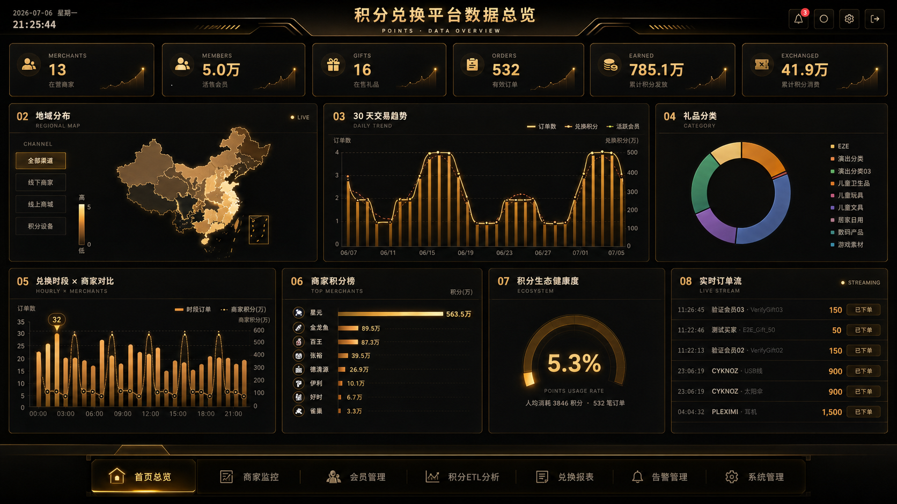

<div align="center">

# 金币联盟 · 积分兑换平台 BI 综合实训

**一个从会员兑换业务到 BI 数据大屏的端到端 Flask 实训项目**


`积分平台系统` + `积分平台 BI 仪表盘` + `数据模型 / ETL / SQL 交付物`

</div>

---

## 项目简介

本项目围绕“金币 / 积分兑换平台”构建了一套完整的商务智能实训作品。

它不是单独的页面展示，而是由两个可运行系统组成：

- **积分平台系统**：模拟会员注册、登录、浏览礼品、购物车、金币兑换、订单、商家后台和积分码生成等真实业务流程。
- **积分平台 BI 仪表盘**：面向运营和管理者，展示会员、商家、礼品、订单、积分流转、ETL 和系统状态。

两者共同覆盖了商务智能项目中的核心链路：

```text
业务操作
  ↓
交易与会员数据沉淀
  ↓
数据建模 / ETL / 指标设计
  ↓
BI 大屏、报表、告警和系统监控
```

---

## 目录

- [项目架构](#项目架构)
- [核心预览](#核心预览)
- [项目一：积分平台系统](#项目一积分平台系统)
- [项目二：积分平台-BI-仪表盘](#项目二积分平台-bi-仪表盘)
- [技术栈](#技术栈)
- [快速启动](#快速启动)
- [目录结构](#目录结构)
- [交付物](#交付物)
- [演示建议](#演示建议)

---

## 项目架构

| 子项目 | 路径 | 端口 | 面向对象 | 项目定位 |
|---|---|---:|---|---|
| 积分平台系统 | `积分平台系统/` | `5000` | 会员、商家 | 产生业务数据，完成金币兑换闭环 |
| 积分平台 BI 仪表盘 | `积分平台BI仪表盘/` | `5002` | 运营、教师、管理者 | 展示经营指标、ETL、报表和系统状态 |
| 旧版金币联盟 | 已删除 | IIS / VS | 对照材料 | 旧 ASP.NET WebForms 原始系统已清理 |
| 最终交付物 | `final/` | - | 评分材料 | 数据模型、SQL、ETL 文档和打包源码 |

> 说明：会员与商家业务系统已统一命名为 `积分平台系统/`，旧 ASP.NET WebForms 对照目录已清理。

---

## 核心预览

### 积分平台系统

| 首页 | 兑礼列表 |
|---|---|
|  |  |

| 商品详情 | 注册入口 |
|---|---|
|  |  |

### 积分平台 BI 仪表盘

| BI 首页总览 | 商家监控 |
|---|---|
|  |  |

| 会员管理 | ETL 分析 |
|---|---|
|  |  |

| 兑换报表 | 系统资源动画 |
|---|---|
|  |  |

---

## 项目一：积分平台系统

```text
路径：C:\Users\PXHONY\Desktop\wjm\积分平台系统
地址：http://127.0.0.1:5000
```

积分平台系统是会员侧和商家侧共用的兑换业务网站，模拟真实积分商城的核心业务。会员可以注册账号、获得初始金币、浏览礼品、加入购物车、兑换商品，并在个人中心查看订单和收藏；商家可以入驻后台、管理商品品类并批量生成积分码。

### 核心功能

| 模块 | 功能说明 |
|---|---|
| 首页 | 展示品牌定位、精选好礼、平台数据、合作商户、公告和帮助入口 |
| 会员注册 / 登录 | 手机号注册、密码登录、PBKDF2 + salt 哈希存储 |
| 金币兑礼 | 商品列表、分类筛选、金币价格、库存、销量和标签 |
| 商品详情 | 商品大图、兑换说明、加购、收藏、同类推荐 |
| 购物车 | 加入商品、修改数量、删除商品、结算兑换 |
| 订单流程 | 扣减金币、生成订单、记录兑换结果 |
| 个人中心 | 会员资料、金币余额、订单记录、收藏统计 |
| 公告中心 | 活动通知、服务升级、节日福利等公告内容 |
| 帮助中心 | 新手引导、常见问题、关于我们、联系方式 |
| 数据兼容 | 主用 SQLite 演示库，保留 SQL Server 兼容层 |

### 业务闭环

```text
注册会员
  ↓
获得初始金币
  ↓
浏览金币礼品
  ↓
加入购物车 / 收藏
  ↓
金币兑换
  ↓
生成订单
  ↓
个人中心查看资产与订单
```

### 数据表

| 表 | 说明 |
|---|---|
| `users` | 会员账号、资料、金币余额 |
| `products` | 可兑换商品 |
| `cart_items` | 购物车 |
| `orders` | 兑换订单 |
| `favorites` | 收藏商品 |
| `announcements` | 公告 |
| `helps` | 帮助中心内容 |
| `checkins` | 签到记录 |
| `merchants` | 商家账号 |
| `coin_codes` | 积分码 / 金币码 |
| `user_merchants` | 用户与商家关系 |

---

## 项目二：积分平台 BI 仪表盘

```text
路径：C:\Users\PXHONY\Desktop\wjm\积分平台BI仪表盘
地址：http://127.0.0.1:5002
```

积分平台 BI 仪表盘是运营和管理侧的大屏系统，用于集中展示积分兑换平台的经营指标、交易趋势、会员行为、商家表现、ETL 过程和系统状态。

### 核心功能

| 模块 | 功能说明 |
|---|---|
| 首页总览 | 展示商家数、会员数、礼品数、订单数、积分发放和消费等 KPI |
| 地域分布 | 以地图方式展示省份 / 区域维度的订单、会员和积分表现 |
| 交易趋势 | 展示近 30 天订单量、积分消耗和活跃会员变化 |
| 礼品分类 | 统计不同礼品分类的兑换占比 |
| 商家监控 | 商家列表、商家积分收入、订单贡献、会员贡献 |
| 会员管理 | 会员列表、积分余额、来源商家、会员详情 |
| ETL 分析 | 展示数据抽取、清洗、汇总和可视化链路 |
| 兑换报表 | 按日期、商家、分类生成兑换分析报表 |
| 告警管理 | 展示异常订单、风险提示和待处理告警 |
| 系统管理 | 展示服务器、数据库、ETL、Web 服务状态 |
| 虚拟资源动画 | 系统页用动态柱状图 + 折线图模拟 CPU、内存、磁盘和负载波动 |

### 主要 API

| API | 说明 |
|---|---|
| `/api/all` | 首页聚合数据 |
| `/api/kpi` | KPI 汇总 |
| `/api/trend` | 交易趋势 |
| `/api/top_merchants` | 商家排行 |
| `/api/top_gifts` | 礼品排行 |
| `/api/category_pie` | 礼品分类占比 |
| `/api/region` | 地域分布 |
| `/api/recent_orders` | 实时订单流 |
| `/api/merchants` | 商家列表 |
| `/api/members` | 会员列表 |
| `/api/etl_status` | ETL 状态 |
| `/api/report_summary` | 报表汇总 |
| `/api/alerts` | 告警列表 |
| `/api/system_info` | 系统状态 |

---

## 技术栈

| 层级 | 积分平台系统 | 积分平台 BI 仪表盘 |
|---|---|---|
| 后端 | Flask | Flask |
| 模板 | Jinja2 | Jinja2 |
| 数据库 | SQLite，SQL Server 兼容层 | SQL Server / 演示数据 |
| 可视化 | 原生 CSS / JS | ECharts |
| 启动方式 | `start.bat` | `start.bat` |
| 端口 | `5000` | `5002` |
| 运行环境 | Python 3.10 `.venv` | Python 3.10 `.venv` |

---

## 快速启动

### 1. 启动积分平台系统

```bat
cd C:\Users\PXHONY\Desktop\wjm\积分平台系统
start.bat
```

访问：

```text
http://127.0.0.1:5000
```

### 2. 启动积分平台 BI 仪表盘

```bat
cd C:\Users\PXHONY\Desktop\wjm\积分平台BI仪表盘
start.bat
```

访问：

```text
http://127.0.0.1:5002
```

### 3. 停止服务

分别进入对应项目目录执行：

```bat
stop.bat
```

---

## 目录结构

```text
wjm/
├── README.md
├── img/
│   ├── jinbi-home.png
│   ├── jinbi-gift-list.png
│   ├── jinbi-gift-detail.png
│   ├── bi-dashboard-overview.png
│   ├── bi-merchant-monitor.png
│   └── ...
├── 积分平台系统/
│   ├── app.py
│   ├── db.py
│   ├── instance/
│   ├── static/
│   ├── templates/
│   ├── start.bat
│   └── README.md
├── 积分平台BI仪表盘/
│   ├── app/
│   ├── docs/
│   ├── sql/
│   ├── tests/
│   ├── start.bat
│   └── README.md
├── final/
├── data/
└── 实训报告/
```

---

## 交付物

`final/` 目录用于整理实训评分材料：

```text
final/
├── 00_交付物总览.md
├── 01_数据模型文档/
├── 02_完整SQL脚本/
├── 03_ETL逻辑文档/
└── 04_项目打包zip/
```

交付内容包括：

- 数据模型文档
- 完整 SQL 建库脚本
- ETL 逻辑说明
- 项目源码打包
- 项目 README
- 运行截图

---

## 演示建议

推荐按下面顺序展示项目：

1. 打开 `http://127.0.0.1:5000`，说明积分平台系统的业务定位。
2. 进入 `/gift`，展示商品列表、分类筛选和金币价格。
3. 打开商品详情，说明加购、收藏、兑换和订单流程。
4. 打开 `http://127.0.0.1:5002`，展示 BI 首页总览。
5. 切换商家、会员、ETL、报表页面，说明多维分析能力。
6. 打开 `/system`，展示系统状态和虚拟资源动画。
7. 结合 `final/` 中的数据模型和 ETL 文档，说明从业务系统到 BI 分析的完整链路。

---

## 当前状态

- 积分平台系统可访问：`http://127.0.0.1:5000`
- 积分平台 BI 仪表盘可访问：`http://127.0.0.1:5002`
- 两个项目均已修复为本机 Python 3.10 虚拟环境
- `积分平台系统` 已修复旧机器 `.venv` 路径问题
- `积分平台系统` 已补充 `pyodbc` 依赖
- `积分平台系统` 支持 SQL Server 表缺失时回退到 SQLite
- BI 系统页资源区域已改为虚拟动态动画

---

## 项目亮点

- **端到端实训闭环**：从业务网站到 BI 大屏，不只是静态页面。
- **双系统联动主题**：业务系统负责“产生数据”，BI 仪表盘负责“解释数据”。
- **工程化可运行**：两个项目均提供 `.bat` 启停脚本和独立虚拟环境。
- **兼容演示环境**：即使本机 SQL Server 表结构不完整，也能通过 SQLite / 演示数据完成展示。
- **文档交付完整**：包含 README、截图、数据模型、SQL 脚本和 ETL 文档。

---

## 一句话总结

本项目用 Flask 重做金币兑换业务系统，并用 Flask + ECharts 构建积分平台 BI 仪表盘，完整展示了从业务流程、数据沉淀、ETL 设计到可视化分析的商务智能实训过程。
