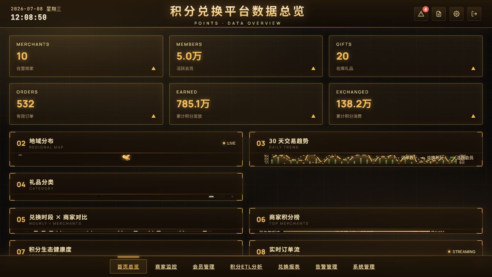
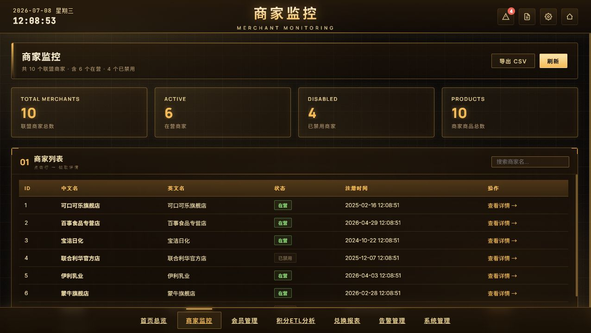
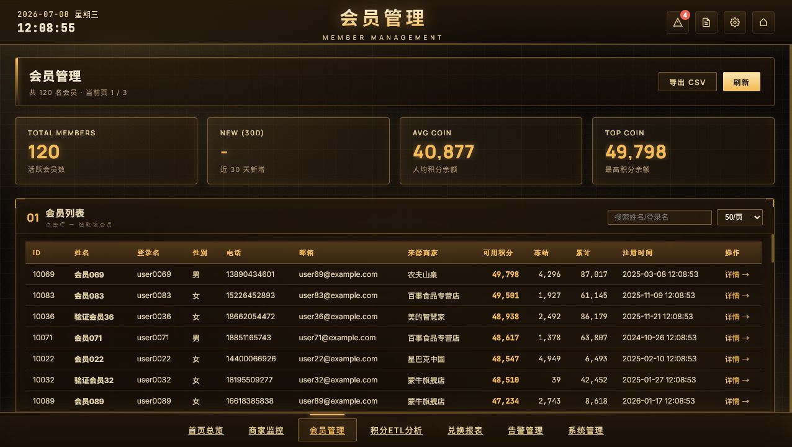
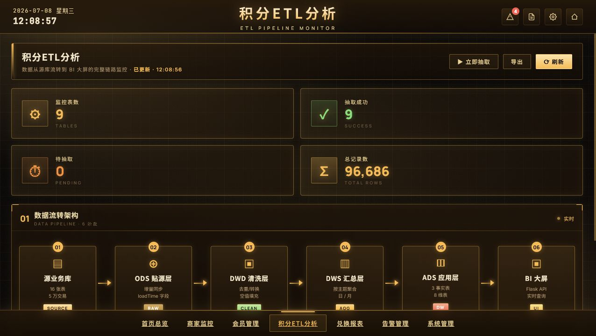
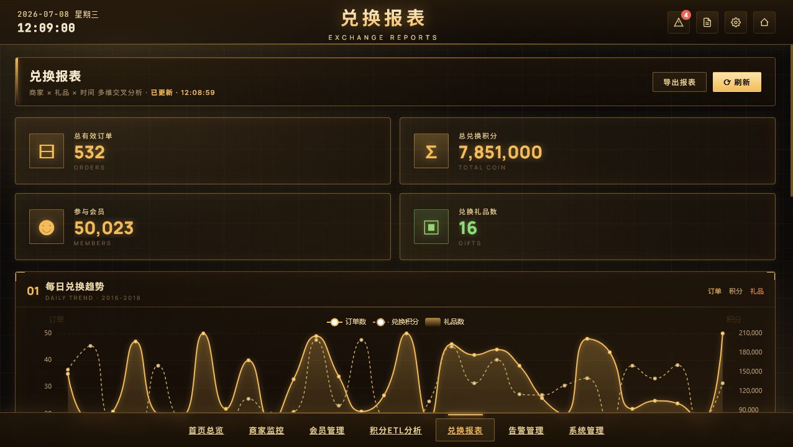
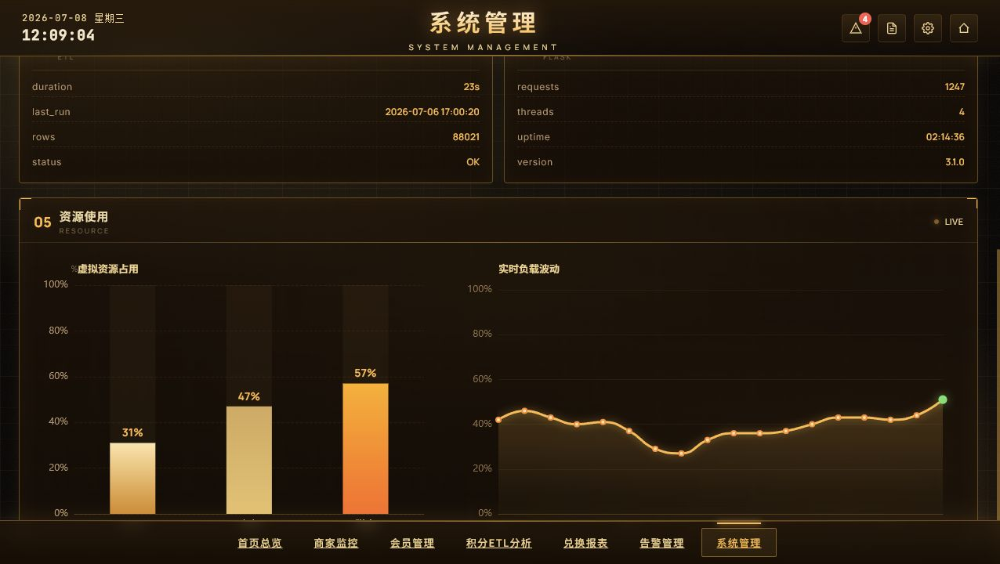

# 积分平台 BI 仪表盘

> 商务智能综合实训项目：积分兑换平台数据总览、运营监控、ETL 过程展示和系统状态看板。

## 项目定位

本项目是“积分 / 金币兑换平台”的 BI 可视化端，负责把商家、会员、礼品、订单、积分流转和 ETL 状态做成可演示的数据大屏。系统使用 Flask 提供页面和 REST API，前端使用 ECharts 展示地图、趋势、排行、报表和系统资源动画。

当前运行地址：

```text
http://127.0.0.1:5002
```

当前环境：

- Python：本机 Python 3.10 虚拟环境 `.venv`
- Web 框架：Flask
- 图表：ECharts
- 数据库：优先连接 SQL Server；本机表结构不匹配或不可用时可使用演示数据
- 端口：`5002`

## 快速启动

```bat
cd C:\Users\PXHONY\Desktop\wjm\积分平台BI仪表盘
start.bat
```

停止服务：

```bat
stop.bat
```

`start.bat` 已调整为优先使用项目内虚拟环境：

```text
.venv\Scripts\python.exe
```

如果 `.venv` 不存在，脚本会在本机创建虚拟环境并安装 `requirements.txt`。

## 核心功能截图

### 首页总览

首页是 BI 大屏主视图，用于快速查看平台整体经营状态。页面集中展示 KPI、区域分布、交易趋势、礼品分类、商家排行、积分生态和实时订单流。



核心能力：

- 顶部 KPI：商家数、会员数、礼品数、订单数、积分发放、积分消费
- 地域分布：按省份 / 区域展示订单、会员和积分规模
- 30 天趋势：展示订单量、积分兑换量和活跃会员变化
- 礼品分类：按品类统计兑换占比
- 商家榜单：展示商家积分贡献和订单表现
- 实时订单流：模拟订单动态刷新，适合课堂演示
- 自动刷新：页面定时拉取 `/api/all` 更新数据

### 商家监控

商家监控页用于查看联盟商家的经营概况，并支持进入商家详情页做下钻分析。



核心能力：

- 商家列表：展示商家名称、状态、创建时间等基础信息
- 商家经营指标：积分收入、订单数量、会员数量
- 商家详情钻取：可按商家查看商品、会员 Top、趋势数据
- 异常识别：结合告警模块展示待处理风险

### 会员管理

会员管理页用于查看平台注册会员、积分余额和会员活跃情况。



核心能力：

- 会员分页列表：支持分页浏览大量会员数据
- 关键词搜索：按会员信息过滤
- 积分账户信息：有效积分、冻结积分、历史积分
- 会员来源：展示会员来自哪个合作商家
- 会员详情：可查看会员兑换记录和积分趋势

### ETL 分析

ETL 页面用于说明从源业务系统到数据仓库再到 BI 大屏的数据处理过程。



核心能力：

- ETL 流程图：展示 ODS、DWD、DWS、ADS / Dashboard 的处理链路
- 抽取状态表：展示各业务表的抽取状态、行数和耗时
- 一键抽取入口：用于模拟或触发 ETL 过程
- 表格滚动与固定表头：适合展示多表抽取明细

### 兑换报表

兑换报表页用于从运营角度分析积分兑换情况。



核心能力：

- 日趋势：按日期查看订单数和积分消耗
- 商家排行：比较商家兑换贡献
- 分类统计：查看不同礼品分类的兑换表现
- 汇总指标：订单数、消耗积分、会员数、兑换礼品数量

### 系统管理

系统管理页用于展示服务器、数据库、ETL 和 Web 服务状态。资源使用区域已改成前端虚拟动态动画，便于演示。



核心能力：

- 服务器状态：CPU、内存、磁盘、操作系统
- 数据库状态：库名、大小、表数量、版本
- ETL 状态：最近运行时间、耗时、行数、状态
- Web 服务状态：请求数、线程数、运行时间、版本
- 虚拟资源动画：CPU / 内存 / 磁盘柱状动画和实时负载折线动画

## 页面与接口

主要页面：

| 页面 | 路径 | 说明 |
|---|---|---|
| 首页总览 | `/` | 平台整体 BI 大屏 |
| 商家监控 | `/merchant` | 商家列表与详情入口 |
| 会员管理 | `/member` | 会员列表与会员详情 |
| 积分 ETL 分析 | `/etl` | ETL 流程和抽取状态 |
| 兑换报表 | `/report` | 兑换趋势、商家榜、分类报表 |
| 告警管理 | `/alert` | 风险告警和处理状态 |
| 系统管理 | `/system` | 服务状态和资源动画 |

主要 API：

| API | 说明 |
|---|---|
| `/api/all` | 首页大屏聚合数据 |
| `/api/kpi` | KPI 汇总 |
| `/api/trend` | 30 天趋势 |
| `/api/top_merchants` | 商家积分榜 |
| `/api/top_gifts` | 礼品兑换榜 |
| `/api/category_pie` | 礼品分类占比 |
| `/api/region` | 地域分布 |
| `/api/hourly` | 24 小时时段分布 |
| `/api/recent_orders` | 实时订单流 |
| `/api/merchants` | 商家列表 |
| `/api/members` | 会员分页 |
| `/api/etl_status` | ETL 状态 |
| `/api/report_summary` | 报表汇总 |
| `/api/alerts` | 告警列表 |
| `/api/system_info` | 系统状态 |

## 目录结构

```text
积分平台BI仪表盘/
├── app/
│   ├── __init__.py
│   ├── __main__.py
│   ├── services/
│   │   ├── db.py
│   │   └── dashboard_service.py
│   ├── static/
│   │   ├── css/
│   │   └── js/
│   └── templates/
├── docs/
├── sql/
├── tests/
├── .env
├── requirements.txt
├── start.bat
├── stop.bat
└── README.md
```

## 数据说明

项目支持两种运行方式：

1. SQL Server 真实数据  
   当本机存在对应数据库和表结构时，页面通过 `pyodbc` 查询 SQL Server。

2. 演示数据  
   当数据库不可用或演示环境不完整时，系统可以使用内置演示数据，保证大屏、子页面和报表可正常展示。

当前本机更适合演示数据方式：SQL Server 可以连接，但部分 `live.*` 表结构与当前代码不完全匹配。

## 实训价值

本项目覆盖 BI 实训中的关键环节：

- 业务主题建模：商家、会员、礼品、订单
- 维度分析：时间、地区、商家、会员、礼品分类、积分方式
- 指标设计：订单数、积分数、会员数、兑换数、商家贡献
- ETL 展示：源表抽取、数据清洗、汇总层、可视化层
- 可视化实现：大屏、报表、排行、趋势、系统监控
- 工程交付：Flask 服务、启动脚本、README、截图和演示数据
