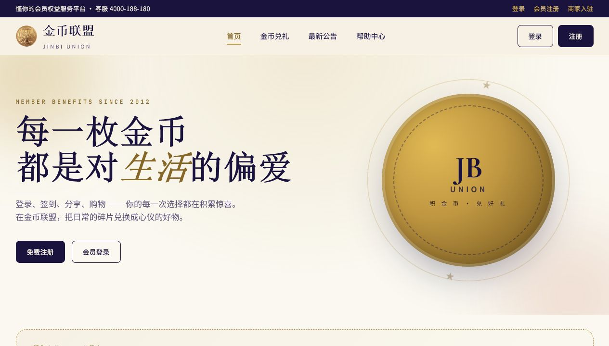
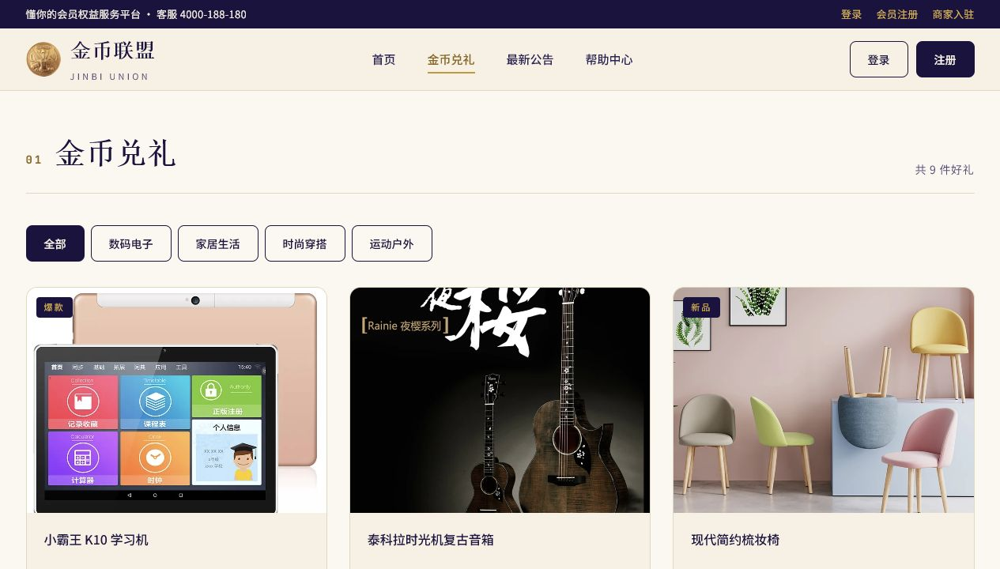
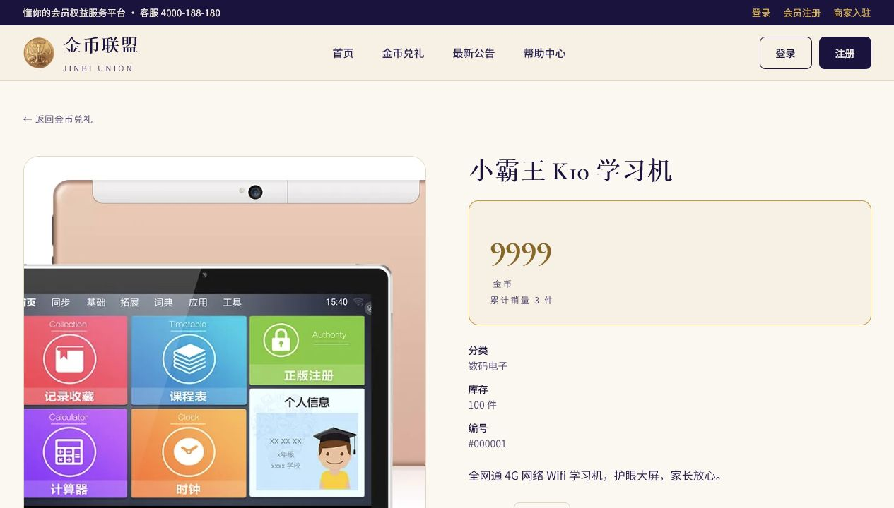
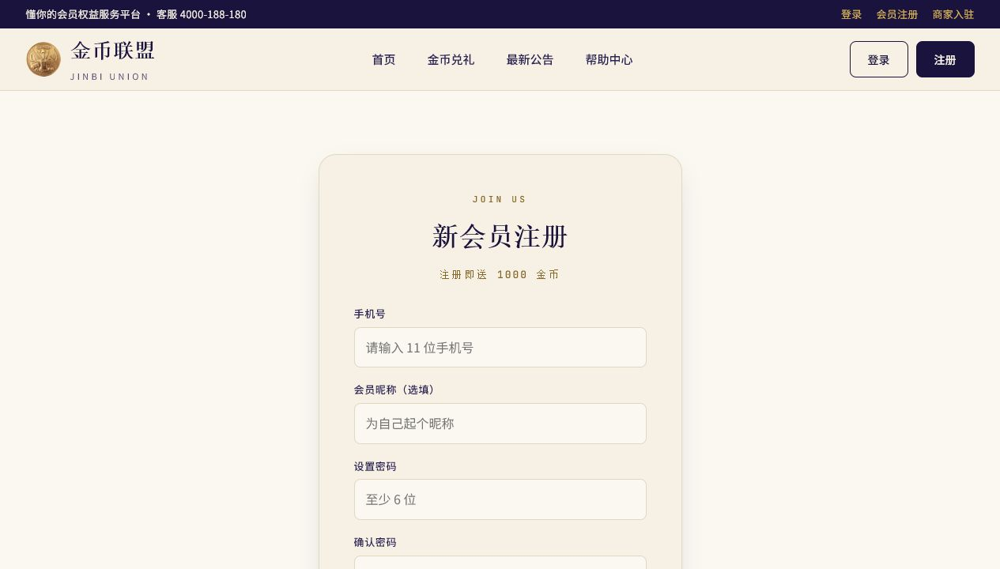
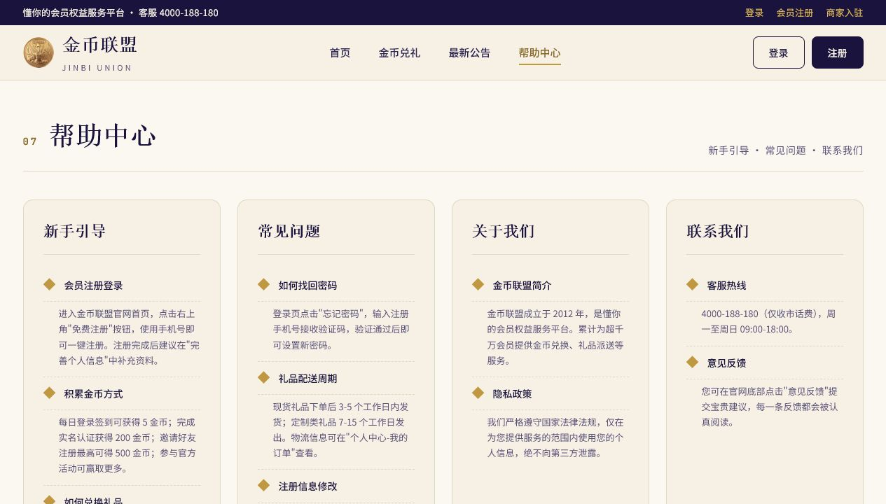

# 积分平台系统

> Flask + SQLite / SQL Server 兼容版积分兑换业务系统。它是旧 ASP.NET WebForms 项目的现代化重做版，也是 BI 仪表盘的数据业务背景。

## 项目定位

积分平台系统是面向会员和商家的积分 / 金币兑换网站。会员可以注册、登录、浏览礼品、查看商品详情、加入购物车、完成金币兑换，并在个人中心查看订单和收藏；商家可以入驻后台并批量生成积分码。

当前运行地址：

```text
http://127.0.0.1:5000
```

当前路径：

```text
C:\Users\PXHONY\Desktop\wjm\积分平台系统
```

说明：本项目已经作为独立 Flask 应用整理到 `积分平台系统/`。旧 ASP.NET WebForms 对照目录已清理。

## 快速启动

```bat
cd C:\Users\PXHONY\Desktop\wjm\积分平台系统
start.bat
```

停止服务：

```bat
stop.bat
```

启动脚本已修复：

- 优先使用本机 Python 3.10 创建虚拟环境
- 自动识别并重建从旧机器复制来的失效 `.venv`
- 自动安装 `requirements.txt`
- 服务监听 `5000`

## 当前环境

- Python：本机 Python 3.10 虚拟环境 `.venv`
- Web 框架：Flask
- 数据库：本地 SQLite 为演示主数据源
- SQL Server：保留兼容层，若本机 `live.*` 表不存在，会自动回退到 SQLite
- 端口：`5000`

## 核心功能截图

### 首页

首页用于展示金币联盟品牌、精选好礼、平台数据、合作商户、公告和帮助入口。



核心能力：

- 品牌首页：展示金币联盟定位和权益服务入口
- 精选好礼：推荐高频兑换商品
- 商品分类：按数码、家居、穿搭、生活等分类展示
- 平台统计：展示金币发放、礼品兑换、合作商户等运营数据
- 公告入口：引导用户查看活动、维护和福利通知
- 帮助入口：提供新手引导、常见问题和联系方式

### 金币兑礼列表

兑礼列表是用户浏览商品和开始兑换流程的主入口。



核心能力：

- 商品列表：展示商品图、名称、分类、金币价、库存和销量
- 分类筛选：按商品类别过滤
- 商品标签：爆款、新品、限量等视觉提示
- 兑换入口：进入商品详情后可加入购物车或兑换
- 响应式布局：适配不同窗口宽度

### 商品详情

商品详情页用于展示单个礼品的兑换信息，并承接加购、收藏和同类推荐。



核心能力：

- 商品大图和基本信息
- 金币价格、库存、销量、商品描述
- 加入购物车
- 收藏商品
- 同类商品推荐
- 登录态校验：需要登录的操作会引导用户登录

### 注册

注册页用于创建会员账号，新用户注册后获得初始金币。



核心能力：

- 手机号注册
- 昵称和密码录入
- 密码哈希存储：PBKDF2 + salt
- 新用户初始金币
- 表单错误提示
- 注册后进入会员流程

### 帮助中心

帮助中心用于说明平台规则，支持课堂演示时快速解释业务流程。



核心能力：

- 新手引导：注册、登录、兑换流程说明
- 常见问题：金币不足、订单、礼品、签到等问题
- 关于我们：平台介绍
- 联系我们：客服和服务信息
- 演示入口：便于实训演示完整业务闭环

## 业务闭环

```text
会员注册
  ↓
获得初始金币
  ↓
浏览金币礼品
  ↓
查看商品详情
  ↓
加入购物车 / 收藏
  ↓
金币兑换
  ↓
生成订单
  ↓
个人中心查看订单和资产
```

## 核心模块

| 模块 | 路由 | 说明 |
|---|---|---|
| 首页 | `/` | 品牌入口、精选商品、公告和帮助 |
| 金币兑礼 | `/gift` | 商品列表和分类筛选 |
| 商品详情 | `/gift/<id>` | 商品详情、加购、收藏、推荐 |
| 注册 | `/register` | 会员注册 |
| 登录 | `/login` | 会员 / 商家登录 |
| 购物车 | `/cart` | 商品数量调整、移除、结算 |
| 个人中心 | `/user` | 资料、金币、订单、收藏统计 |
| 修改资料 | `/user/edit` | 编辑会员信息 |
| 修改密码 | `/user/change-password` | 原密码校验后修改 |
| 收藏 | `/user/favorites` | 查看收藏商品 |
| 公告 | `/announcements` | 公告列表 |
| 公告详情 | `/announcements/<id>` | 查看公告正文 |
| 帮助中心 | `/help` | 新手引导、常见问题、关于我们 |

## 数据模型

主要表：

| 表 | 说明 |
|---|---|
| `users` | 会员账号、资料、金币余额 |
| `products` | 可兑换商品 |
| `favorites` | 用户收藏 |
| `cart_items` | 购物车 |
| `orders` | 兑换订单 |
| `announcements` | 公告 |
| `helps` | 帮助中心内容 |
| `checkins` | 签到记录 |
| `merchants` | 商家账号 |
| `coin_codes` | 积分码 / 金币码 |
| `user_merchants` | 用户与商家关系 |

## 技术特点

- Flask 单体应用，便于实训环境启动
- SQLite 自带演示数据，避免依赖外部数据库
- 保留 SQL Server 兼容层，便于和 BI / 数据仓库主题关联
- 密码使用 PBKDF2 哈希，避免明文存储
- 购物车和订单流程使用数据库事务语义
- 旧 ASP.NET WebForms 系统作为重构对照

## 与 BI 项目的关系

`积分平台系统` 是业务系统，负责模拟用户侧金币兑换流程；`积分平台BI仪表盘` 是数据分析系统，负责把业务结果汇总成可视化大屏。

两者共同组成完整实训链路：

```text
业务操作 → 交易数据 → 数据建模 / ETL → BI 大屏展示
```
